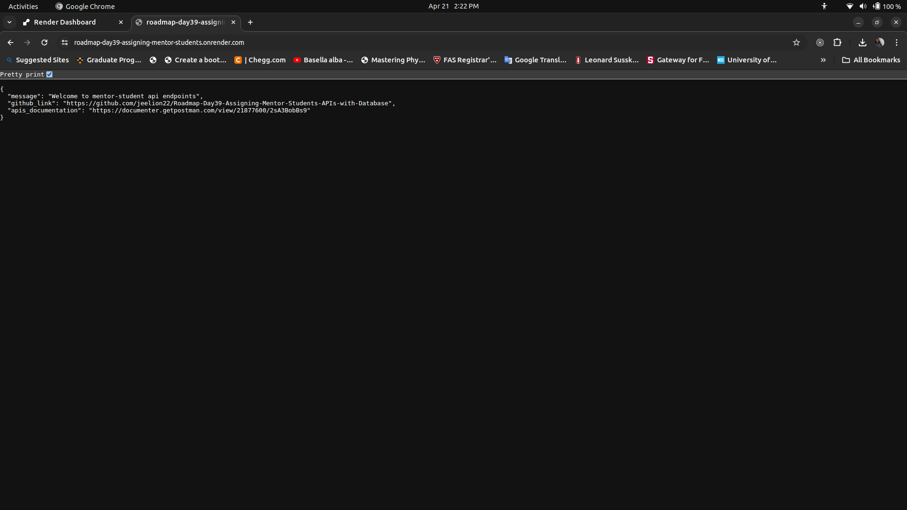
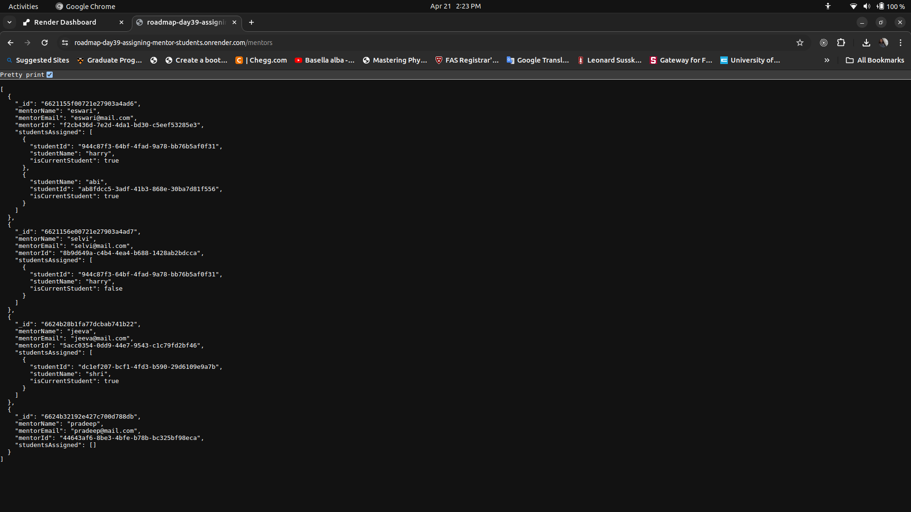
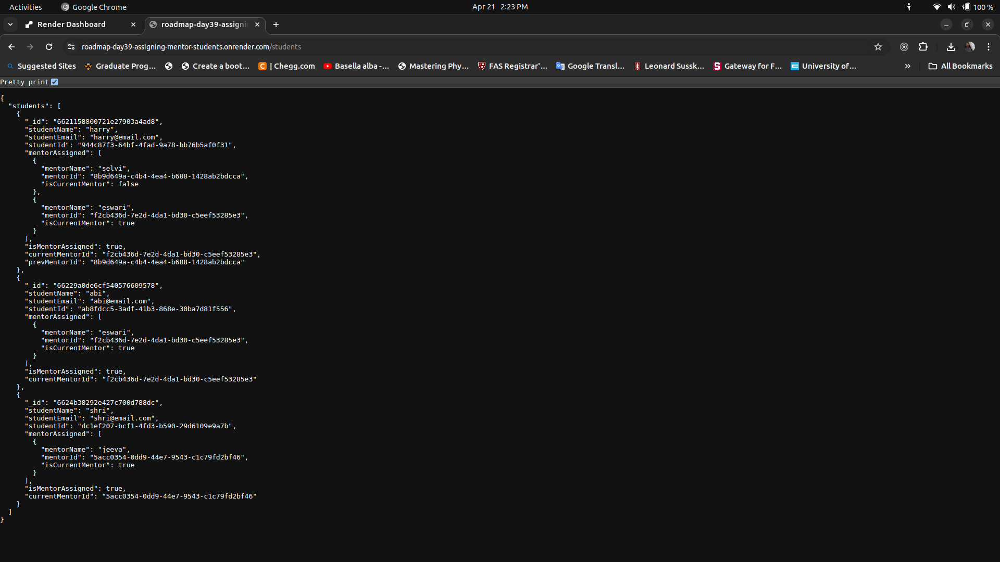
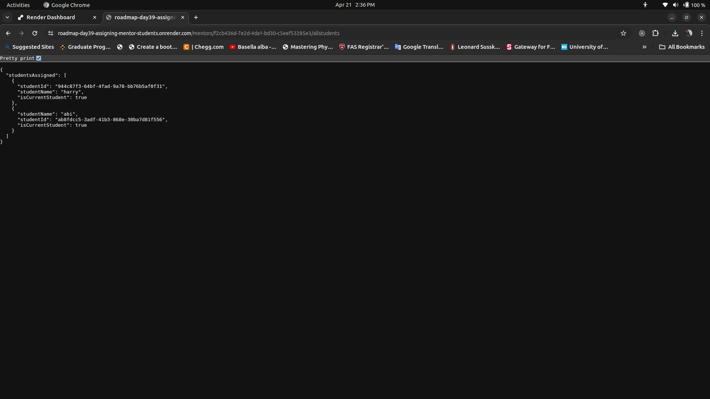
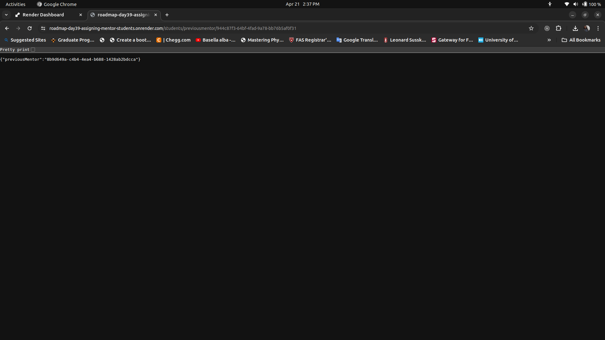

## Roadmap-Day39-Assigning-Mentor-Students-APIs-with-Database

This repository contains a series of RESTful APIs designed for the creation and management of MongoDB databases specifically tailored for mentors and students collections. Built using ExpressJS on a NodeJS platform

This server is deployed in [Render](https://render.com/)

The complete documentation for using APIs is available at [postman api documentation](https://documenter.getpostman.com/view/21877600/2sA3BobBs9)

## APIs' Links:

[Homepage](https://roadmap-day39-assigning-mentor-students.onrender.com/) - **GET**

[For creating mentor](https://roadmap-day39-assigning-mentor-students.onrender.com/mentors/create) - **POST**

[For listing all mentors](https://roadmap-day39-assigning-mentor-students.onrender.com/mentors) - **GET**

[for creating student](https://roadmap-day39-assigning-mentor-students.onrender.com/students/create) - **POST**

[For listing all students](https://roadmap-day39-assigning-mentor-students.onrender.com/students/) - **GET**

[For assiging multiple students to a mentor](https://roadmap-day39-assigning-mentor-students.onrender.com/mentor/students/assign) - **PUT**

[For assigning a student to a mentor, change mentor or student vice versa](https://roadmap-day39-assigning-mentor-students.onrender.com/students/dc1ef207-bcf1-4fd3-b590-29d6109e9a7b/mentors/ 5acc0354-0dd9-44e7-9543-c1c79fd2bf46/assign) - **PUT-both student and mentor ids required as a url parameters**

[Get all students of a mentor](https://roadmap-day39-assigning-mentor-students.onrender.com/mentors/f2cb436d-7e2d-4da1-bd30-c5eef53285e3/allstudents) - **GET-mentor id required**

[Previous mentor of student](https://roadmap-day39-assigning-mentor-students.onrender.com/students/previousmentor/944c87f3-64bf-4fad-9a78-bb76b5af0f31) - **GET-student id required**

## Images of responses for some get method requests from Chrome

Rooms Available:

Mentors' Information:

Students' Information

